<div align="center">


<h1>Pipeline Orchestrator Platform</h1>

<p><strong>The Enterprise Command Center for Multi-Cloud CI/CD & DAG Workflow Orchestration.</strong></p>

[]()
[]()
[]()

<br/>

> **"Orchestrate everything, manually do nothing."** 
> **Pipeline Orchestrator** is a next-generation platform designed to handle the complexity of modern, multi-stage, multi-cloud software delivery. It moves beyond simple linear CI/CD by providing a powerful DAG engine that manages complex dependencies, parallel execution, and automated rollbacks.

</div>

---

## 🏛️ Executive Summary

As organizations scale, the complexity of deploying microservices across multiple regions and clouds grows exponentially. Standard CI/CD tools often struggle with inter-pipeline dependencies, environment promotions, and consistent governance across teams. Organizations often fail to achieve rapid delivery because they lack a unified "Orchestration" layer for their software supply chain.

This platform provides the **Delivery Control Plane**. It implements a complete **Enterprise CI/CD & GitOps Framework**, enabling Platform Engineers to manage the delivery lifecycle as a first-class citizen. By automating the orchestration of complex Directed Acyclic Graphs (DAGs) and implementing institutional approval gates, we ensure that every code commit—from development to production—is tested, secured, and deployed with zero human error and full forensic auditability.

---

## 📐 Architecture Storytelling: Principal Reference Models

### 1. Principal Architecture: Global Pipeline Orchestrator & Delivery Control Plane
This diagram illustrates the end-to-end flow from code commit and event triggering to DAG resolution, parallel execution, and institutional delivery auditing.

```mermaid
graph LR
    %% Subgraph Definitions
    subgraph TriggerHub["Event Ingress & Triggers"]
        direction TB
        Git["Git Webhooks (GitHub/Lab)"]
        Cron["Cron & Scheduled Jobs"]
        Events["Cloud Events & S3 Hooks"]
    end

    subgraph IntelligenceEngine["Orchestration Intelligence Hub"]
        direction TB
        API["FastAPI Orchestrator Gateway"]
        DAGEngine["DAG Resolution Engine"]
        Approval["Policy & Approval Gate"]
        Scheduler["Execution Scheduler"]
    end

    subgraph ExecutionPlane["Distributed Worker Fleet"]
        direction TB
        K8s["EKS Worker Nodes"]
        Serverless["Lambda Execution Agents"]
        Remote["Hybrid-Cloud Runners"]
    end

    subgraph OperationsHub["Institutional Delivery Hub"]
        direction TB
        Scorecard["DORA Metrics Scorecard"]
        Analytics["Build & Test Analytics"]
        Audit["Forensic Delivery Lake"]
    end

    subgraph DevOps["Pipeline-as-Code Orchestration"]
        direction TB
        TF["Terraform Pipeline Modules"]
        OPA["Governance-as-Code Policies"]
        Vault["Secret Injection (JIT)"]
    end

    %% Flow Arrows
    TriggerHub -->|1. Event Trigger| API
    API -->|2. Resolve DAG| DAGEngine
    DAGEngine -->|3. Validate Policy| Approval
    Approval -->|4. Dispatch Job| Scheduler
    
    Scheduler -->|5. Execute Tasks| ExecutionPlane
    ExecutionPlane -->|6. Store Artifact| Audit
    ExecutionPlane -->|7. Stream Logs| Analytics
    
    API -->|8. Visualize Health| Scorecard
    Scorecard -->|9. Gather Proof| Audit
    Scorecard -->|10. Record Resolution| TriggerHub
    
    TF -->|11. Provision Hub| IntelligenceEngine
    Vault -->|12. Inject Secrets| ExecutionPlane
    Audit -->|13. Improve Process| TriggerHub

    %% Styling
    classDef trigger fill:#f5f5f5,stroke:#616161,stroke-width:2px;
    classDef intel fill:#e8eaf6,stroke:#1a237e,stroke-width:2px;
    classDef execute fill:#e1f5fe,stroke:#01579b,stroke-width:2px;
    classDef ops fill:#e0f2f1,stroke:#004d40,stroke-width:2px;
    classDef devops fill:#fffde7,stroke:#f57f17,stroke-width:2px;

    class TriggerHub trigger;
    class IntelligenceEngine intel;
    class ExecutionPlane execute;
    class OperationsHub ops;
    class DevOps devops;
```

### 2. The Delivery Lifecycle Management Flow
The continuous path of a software change from initial commit and building to testing, staging, securing, deploying, and active verification.

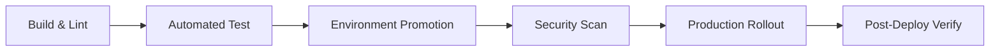

### 3. GitOps & Push-Based vs. Pull-Based Flow
Strategic orchestration of "Push" models (CI/CD pipelines) and "Pull" models (GitOps reconciliation) to ensure the desired state is always maintained in production.

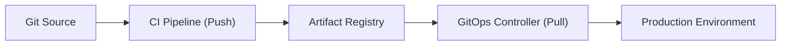

### 4. Multi-Stage Pipeline Gating & Approval Flow
Implementing automated policy gates (SAST/DAST) and manual SRE promotion sign-offs to ensure that only compliant artifacts can reach high-security environments.

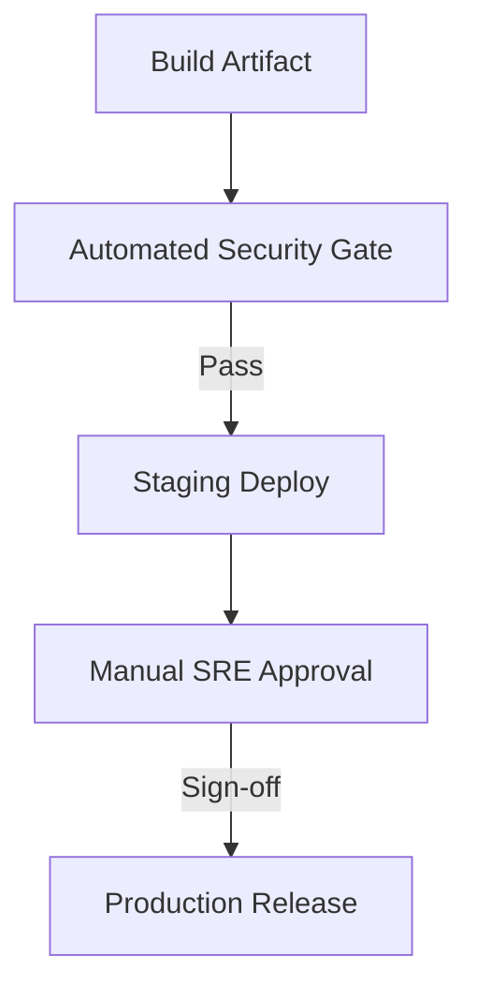

### 5. Compliance & Security Scanning Hub
Orchestrating the integration of SAST, DAST, and SCA scanning tools within the delivery pipeline to neutralize vulnerabilities before they are deployed.

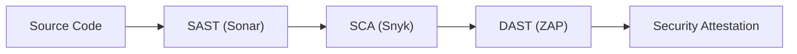

### 6. Ephemeral Environment Provisioning Flow
On-demand infrastructure provisioning for Pull Request validation, enabling developers to test features in isolated, high-fidelity environments before merging.

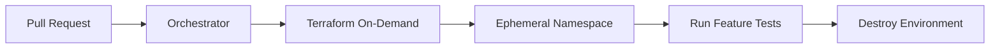

### 7. Institutional Delivery Scorecard
Grading organizational performance based on DORA metrics: Deployment Frequency, Lead Time for Changes, MTTR, and Change Failure Rate.

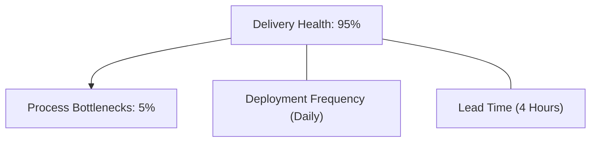

### 8. Identity & RBAC for Pipeline Ops
Managing fine-grained access to pipeline definitions, execution controls, and deployment secrets between developers, auditors, and admins.

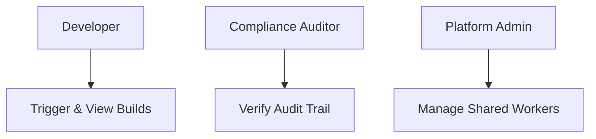

### 9. Deployment Strategies (Canary/Blue-Green) Hub
Orchestrating safe, zero-downtime releases through advanced deployment patterns that mitigate the risk of production outages.

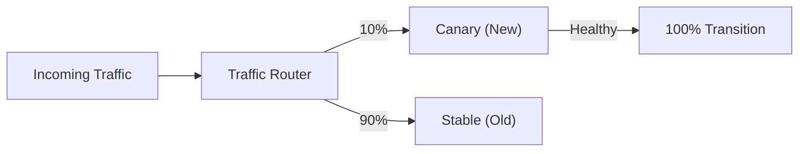

### 10. IaC Deployment: Pipeline-as-Code Framework
Using Terraform to deploy and manage the versioned distribution of the orchestrator hub, distributed runners, and artifact storage infrastructure.

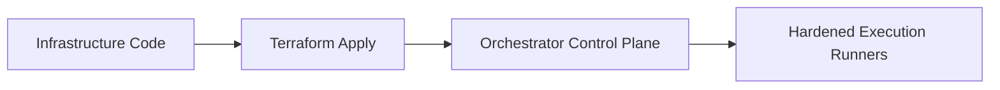

### 11. Metadata Lake for Forensic Delivery Audit
Storing long-term records of every build artifact, test result, and deployment event for institutional investigation and regulatory compliance.

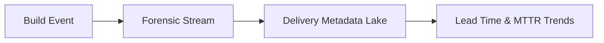

---

## 🏛️ Core Orchestration Pillars

1.  **DAG-Based Delivery**: Managing complex, dependency-aware workflows with maximum parallel efficiency.
2.  **Event-Driven Orchestration**: Automating execution based on code changes, cloud events, and scheduled triggers.
3.  **Institutional Approval Gates**: Enforcing mandatory security and management sign-offs for production promotions.
4.  **Ephemeral Environment Scaling**: Provisioning isolated, on-demand infrastructure for high-fidelity feature testing.
5.  **DORA-Driven Analytics**: Measuring and optimizing organizational delivery performance through automated metric tracking.
6.  **Full Auditability**: Immutable recording of every software change and deployment for institutional record-keeping.

---

## 🛠️ Technical Stack & Implementation

### Orchestration Engine & APIs
*   **Framework**: Python 3.11+ / FastAPI.
*   **Event Bus**: Kafka for decoupled, highly scalable orchestration events across the enterprise.
*   **DAG Engine**: Custom resolution logic for managing complex dependency graphs and parallel execution.
*   **State Management**: PostgreSQL (Metadata Lake) and Redis (Real-time Execution Cache).
*   **Auth Orchestrator**: Federated OIDC/JWT for secure pipeline triggers and RBAC.

### Pipeline Dashboard (UI)
*   **Framework**: React 18 / Vite.
*   **Theme**: Dark, Indigo, Emerald (High-tech, reliable aesthetic).
*   **Visualization**: React Flow for interactive DAG design and real-time execution tracking.

### Infrastructure & DevOps
*   **Runtime**: AWS EKS or Azure Kubernetes Service (AKS).
*   **Execution**: Distributed fleet of hardened runners across multi-cloud environments.
*   **IaC**: Modular Terraform for deploying the orchestrator hub and runner distributions.

---

## 🏗️ IaC Mapping (Module Structure)

| Module | Purpose | Real Services |
| :--- | :--- | :--- |
| **`infrastructure/orch_hub`** | Central management plane | EKS, PostgreSQL, Redis |
| **`infrastructure/runners`** | Distributed execution fleet | Auto-scaling Nodes, Lambda |
| **`infrastructure/bus`** | Event orchestration backbone | Kafka, EventBridge |
| **`infrastructure/auditing`** | Forensic delivery sinks | S3, Athena, Quicksight |

---

## 🚀 Deployment Guide

### Local Principal Environment
```bash
# Clone the orchestrator platform
git clone https://github.com/devopstrio/pipeline-orchestrator.git
cd pipeline-orchestrator

# Configure environment
cp .env.example .env

# Launch the Orchestrator stack
make up

# Trigger a mock DAG execution simulation
make simulate-execution
```

Access the Pipeline Dashboard at `http://localhost:3000`.

---

## 📜 License
Distributed under the MIT License. See `LICENSE` for more information.

---
<div align="center">
  <p>© 2026 Devopstrio. All rights reserved.</p>
</div>
