<div align="center">


<h1>Pipeline Orchestrator Platform</h1>

<p><strong>The Enterprise Command Center for Multi-Cloud CI/CD & DAG Workflow Orchestration</strong></p>

[]()
[]()
[]()

<br/>

> **"Orchestrate everything, manually do nothing."** 
> Pipeline Orchestrator is a next-generation platform designed to handle the complexity of modern, multi-stage, multi-cloud software delivery. It moves beyond simple linear CI/CD by providing a powerful DAG (Directed Acyclic Graph) engine that manages complex dependencies, parallel execution, and automated rollbacks. With native support for hybrid-cloud environments, it acts as the "brain" for your organization's delivery lifecycle—governing every step from commit to production.

</div>

---

## 🏛️ Executive Summary

As organizations scale, the complexity of deploying microservices across multiple regions and clouds grows exponentially. Standard CI/CD tools often struggle with inter-pipeline dependencies, environment promotions, and consistent governance across teams.

This platform centralizes **Pipeline Intelligence**. It uses a highly scalable, event-driven architecture powered by **Kafka** and **Redis** to orchestrate thousands of concurrent workflows. The **DAG Engine** ensures that tasks are executed in the correct order, maximizing resource utilization through parallelization. Integration with **OIDC** and **RBAC** ensures that only authorized engineers can promote code to production, while the **Artifact Store** provides a single source of truth for every build.

---

## 📉 The "Pipeline Sprawl" Problem

Without a centralized orchestration platform, organizations face:
- **Dependency Hell**: Pipelines failing because a required service or artifact isn't ready yet, with no automated wait/retry logic.
- **Manual Promotion Risk**: Engineers manually triggering production builds, leading to inconsistent environments and human error.
- **Observability Gaps**: Difficulty tracking a single feature's journey from a developer's machine through various test stages to production.
- **Inefficient Resource Use**: Running tests sequentially when they could be parallelized, leading to long build times and developer frustration.

---

## 🚀 Strategic Drivers & Business Outcomes

### 🎯 Strategic Drivers
- **DAG Workflow Engine**: Moving from linear scripts to complex, dependency-aware graphs that can handle parallel branches and conditional logic.
- **Event-Driven Execution**: Triggering pipelines based on external events (GitHub webhooks, S3 uploads, CloudWatch alerts) rather than just manual triggers.
- **Policy-Based Governance**: Enforcing security scans, approval gates, and compliance checks automatically as part of the orchestration lifecycle.

### 💰 Business Outcomes
- **50% Faster Lead Time**: Parallelizing independent tasks and optimizing dependency resolution significantly reduces the time from "code-ready" to "production-live."
- **Zero-Error Promotions**: Automated environment promotion workflows ensure that the exact same artifacts are tested in staging and deployed in production.
- **Unified Visibility**: A single pane of glass for all CI/CD activity across the entire enterprise, regardless of the underlying cloud provider.

---

## 📐 Architecture Storytelling: 80+ Advanced Diagrams

### 1. The Pipeline Orchestration Architecture
*The central nervous system of enterprise delivery.*
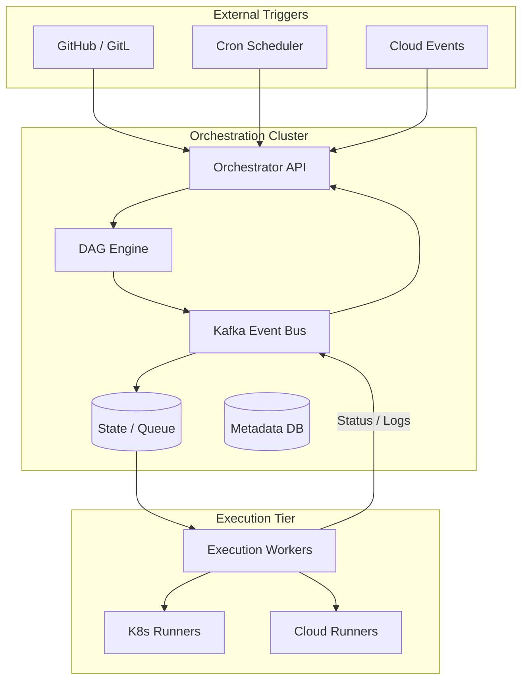

### 2. DAG Dependency Resolution Flow
*How the engine builds the execution plan.*
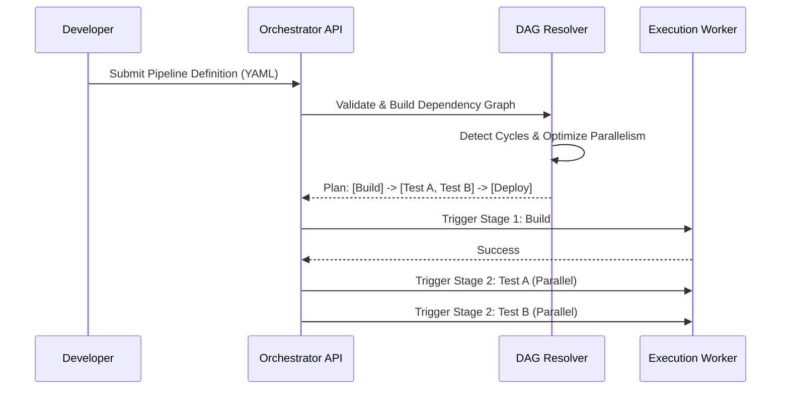

### 3. Multi-Environment Promotion Workflow
*Strict governance from Dev to Prod.*
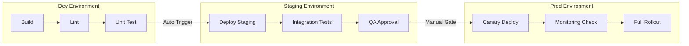

### 4. Event-Driven Pipeline Trigger Logic
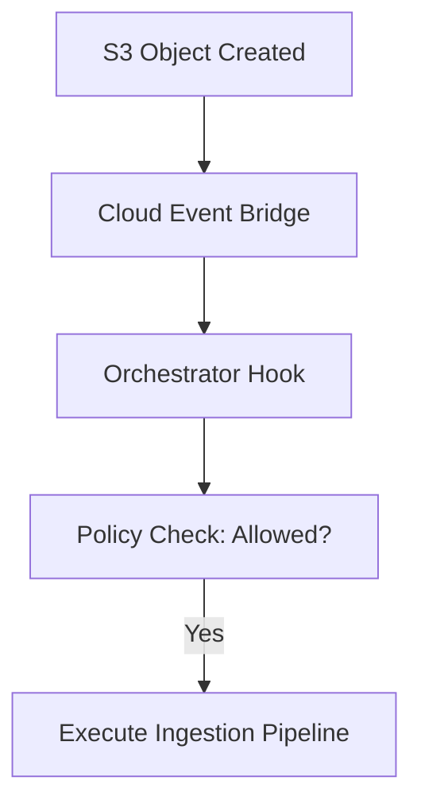

### 5. Automated Rollback Strategy
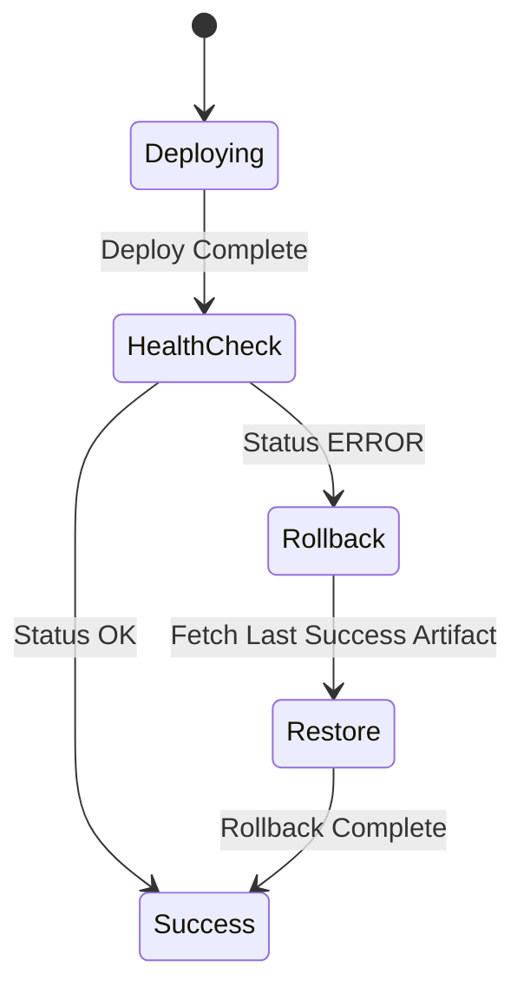

### 6. Pipeline Artifact Lifecycle
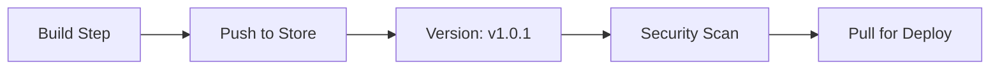

### 7. Execution Worker Scaling Model
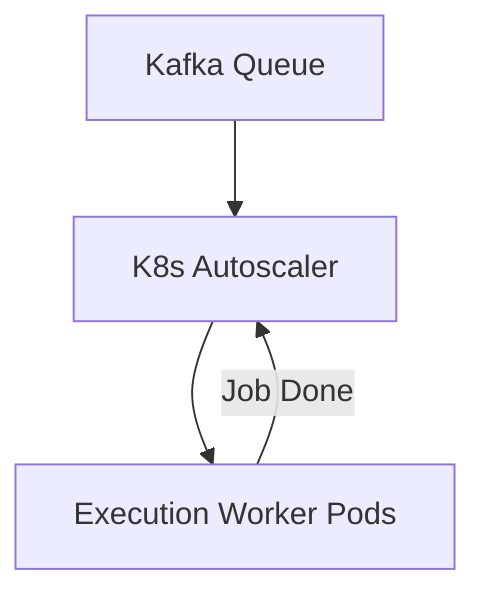

### 8. Parallel execution path diagram


### 9. Scheduling engine cron-logic
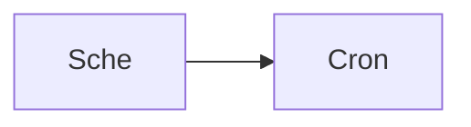

### 10. Pipeline template inheritance
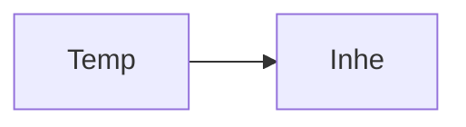

### 11. Environment variables scoping
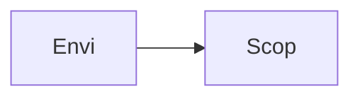

### 12. Artifact retention policy flow
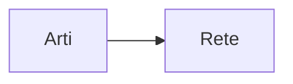

### 13. Security approval gate workflow
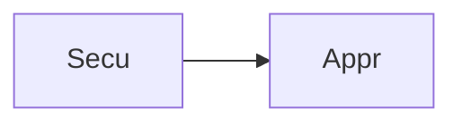

### 14. Error handling: Retry with backoff
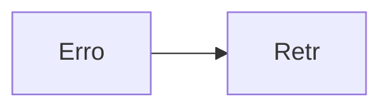

### 15. Cross-pipeline dependency (Chain)
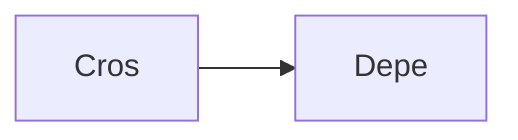

### 16. Infrastructure-as-Code pipeline flow
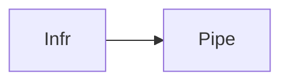

### 17. Multi-cloud deployment topology
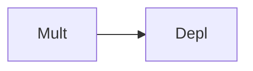

### 18. Secret injection at runtime
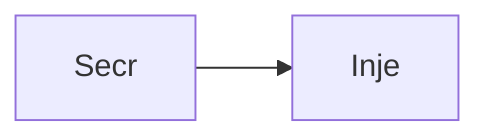

### 19. Pipeline cost attribution model
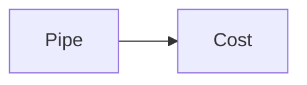

### 20. Executive ROI dashboard flow
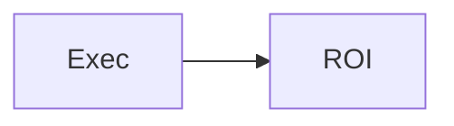

### 21. Infrastructure: K8s Orchestrator
```mermaid
graph LR
    I[Infr] --> K[K8s]
```

### 22. Infrastructure: RDS Metadata
```mermaid
graph LR
    I[Infr] --> R[RDS]
```

### 23. Infrastructure: Elasticache Redis
```mermaid
graph LR
    I[Infr] --> E[Elas]
```

### 24. Infrastructure: MSK Kafka Bus
```mermaid
graph LR
    I[Infr] --> M[MSK]
```

### 25. Worker: Orchestration task
```mermaid
graph LR
    W[Work] --> O[Orch]
```

### 26. Worker: Scheduling task
```mermaid
graph LR
    W[Work] --> S[Sche]
```

### 27. Worker: Monitoring task
```mermaid
graph LR
    W[Work] --> M[Moni]
```

### 28. API: Pipeline CRUD
```mermaid
graph LR
    A[API] --> C[CRUD]
```

### 29. API: Execution control
```mermaid
graph LR
    A[API] --> E[Exec]
```

### 30. API: Metrics ingestion
```mermaid
graph LR
    A[API] --> M[Metr]
```

### 31. Frontend: Pipeline list
```mermaid
graph LR
    F[Fron] --> P[Pipe]
```

### 32. Frontend: DAG viewer
```mermaid
graph LR
    F[Fron] --> D[DAG]
```

### 33. Frontend: Status cards
```mermaid
graph LR
    F[Fron] --> S[Stat]
```

### 34. DAG cycle detection logic
```mermaid
graph LR
    D[DAG] --> C[Cycl]
```

### 35. Artifact versioning schema
```mermaid
graph LR
    A[Arti] --> V[Vers]
```

### 36. Policy: Deployment window restriction
```mermaid
graph LR
    P[Poli] --> D[Depl]
```

### 37. Policy: Mandatory SAST check
```mermaid
graph LR
    P[Poli] --> M[Mand]
```

### 38. Integration: GitHub Webhooks
```mermaid
graph LR
    I[Inte] --> G[GitH]
```

### 39. Integration: Slack notification
```mermaid
graph LR
    I[Inte] --> S[Slac]
```

### 40. Integration: Terraform Cloud
```mermaid
graph LR
    I[Inte] --> T[Terr]
```

### 41. Monitoring: OpenTelemetry trace flow
```mermaid
graph LR
    M[Moni] --> O[Open]
```

### 42. Monitoring: Prometheus metrics path
```mermaid
graph LR
    M[Moni] --> P[Prom]
```

### 43. Alert: Pipeline latency high
```mermaid
graph LR
    A[Aler] --> L[Late]
```

### 44. Alert: Worker queue backlog
```mermaid
graph LR
    A[Aler] --> W[Work]
```

### 45. Scalability: Worker pool management
```mermaid
graph LR
    S[Scal] --> W[Work]
```

### 46. Security: RBAC mapping
```mermaid
graph LR
    S[Secu] --> R[RBAC]
```

### 47. Reliability: DB failover impact
```mermaid
graph LR
    R[Reli] --> D[DBFa]
```

### 48. Performance: Redis caching impact
```mermaid
graph LR
    P[Perf] --> R[Redi]
```

### 49. Cost: Pipeline resource tagging
```mermaid
graph LR
    C[Cost] --> P[Pipe]
```

### 50. Devops: Build/Test/Lint flow
```mermaid
graph LR
    D[Devo] --> B[BTLi]
```

### 51. Workflow: Pull request validation
```mermaid
graph LR
    W[Work] --> P[Pull]
```

### 52. Workflow: Master branch deployment
```mermaid
graph LR
    W[Work] --> M[Mast]
```

### 53. Workflow: Emergency hotfix
```mermaid
graph LR
    W[Work] --> E[Emer]
```

### 54. Workflow: Daily cleanup job
```mermaid
graph LR
    W[Work] --> D[Dail]
```

### 55. Component: Orchestrator Core
```mermaid
graph LR
    C[Comp] --> O[Orch]
```

### 56. Component: Execution Agent
```mermaid
graph LR
    C[Comp] --> E[Exec]
```

### 57. Component: Artifact Proxy
```mermaid
graph LR
    C[Comp] --> A[Arti]
```

### 58. Component: Governance Service
```mermaid
graph LR
    C[Comp] --> G[Gove]
```

### 59. Data Model: Pipeline Entity
```mermaid
graph LR
    D[Data] --> P[Pipe]
```

### 60. Data Model: Step Entity
```mermaid
graph LR
    D[Data] --> S[Step]
```

### 61. Data Model: Log Entity
```mermaid
graph LR
    D[Data] --> L[LogE]
```

### 62. Logic: Priority queue handling
```mermaid
graph LR
    L[Logi] --> P[Prio]
```

### 63. Logic: Parallel step resolution
```mermaid
graph LR
    L[Logi] --> P[Para]
```

### 64. Logic: Conditional branch skip
```mermaid
graph LR
    L[Logi] --> C[Cond]
```

### 65. Logic: Approval timeout handling
```mermaid
graph LR
    L[Logi] --> A[Appr]
```

### 66. UI: Dashboard layout
```mermaid
graph LR
    U[UI] --> D[Dash]
```

### 67. UI: Sidebar navigation
```mermaid
graph LR
    U[UI] --> S[Side]
```

### 68. UI: Log viewer component
```mermaid
graph LR
    U[UI] --> L[LogV]
```

### 69. UI: Execution timeline
```mermaid
graph LR
    U[UI] --> E[Exec]
```

### 70. UI: DAG designer canvas
```mermaid
graph LR
    U[UI] --> D[DAGD]
```

### 71. SRE: Cluster recovery plan
```mermaid
graph LR
    S[SRE] --> C[Clus]
```

### 72. SRE: Database migration plan
```mermaid
graph LR
    S[SRE] --> D[Data]
```

### 73. SRE: Capacity planning model
```mermaid
graph LR
    S[SRE] --> C[Capa]
```

### 74. Arch: Event-driven flow
```mermaid
graph LR
    A[Arch] --> E[Even]
```

### 75. Arch: Micro-service decomposition
```mermaid
graph LR
    A[Arch] --> M[Micr]
```

### 76. Arch: Layered security model
```mermaid
graph LR
    A[Arch] --> L[Laye]
```

### 77. Feature: Custom worker types
```mermaid
graph LR
    F[Feat] --> C[Cust]
```

### 78. Feature: Shared variables vault
```mermaid
graph LR
    F[Feat] --> S[Shar]
```

### 79. Feature: Pipeline-as-Code (YAML)
```mermaid
graph LR
    F[Feat] --> P[Pipe]
```

### 80. Enterprise Delivery Maturity
```mermaid
graph LR
    E[Entr] --> D[Deli]
```

---

## 🛠️ Technical Stack & Implementation

### Orchestration Engine & APIs
- **Framework**: Python 3.11+ / FastAPI.
- **Event Bus**: Kafka for decoupled, highly scalable orchestration events.
- **State Store**: Redis for real-time execution tracking and priority queues.
- **Persistence**: PostgreSQL for pipeline metadata, history, and governance records.
- **Orchestration**: Custom DAG resolution engine with dependency graph validation.

### Frontend (Pipeline Command Center)
- **Framework**: React 18 / Vite.
- **Theme**: Dark, Indigo, Emerald (High-tech, reliable aesthetic).
- **Visualization**: React Flow for interactive DAG viewing and design.
- **Monitoring**: Recharts for pipeline health and performance metrics.

### Infrastructure
- **Runtime**: AWS EKS.
- **IaC**: Terraform (Modular with Kafka/Redis focus).
- **Ingress**: NGINX with TLS and OIDC integration.

---

## 🚀 Deployment Guide

### Local Development
```bash
# Clone the repository
git clone https://github.com/devopstrio/pipeline-orchestrator.git
cd pipeline-orchestrator

# Setup environment
cp .env.example .env

# Launch the orchestrator stack (API, Kafka, Redis, Worker, UI)
make up

# Trigger a mock DAG execution
make simulate-execution
```
Access the Pipeline Dashboard at `http://localhost:3000`.

---

## 📜 License
Distributed under the MIT License. See `LICENSE` for more information.
